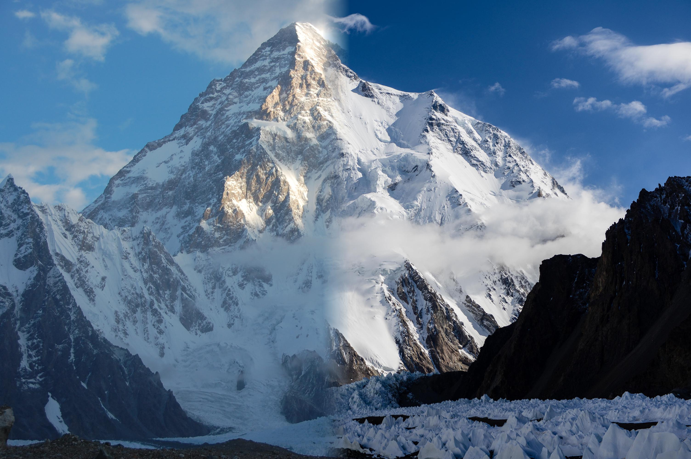

# Pyramid-Blending-and-Feathering

Compositing is the process of copying or inserting a part of one image into another image. Good compositing is hard for many reasons: because the image content must match in perspective, lighting, and in scene sense; because we must handle pixels at the edge of an image part which integrates light from the unwanted and wanted parts (e.g., the background and foreground); and because some objects are translucent or transparent and show the background.

Image 1:

Image 2:

Result :

